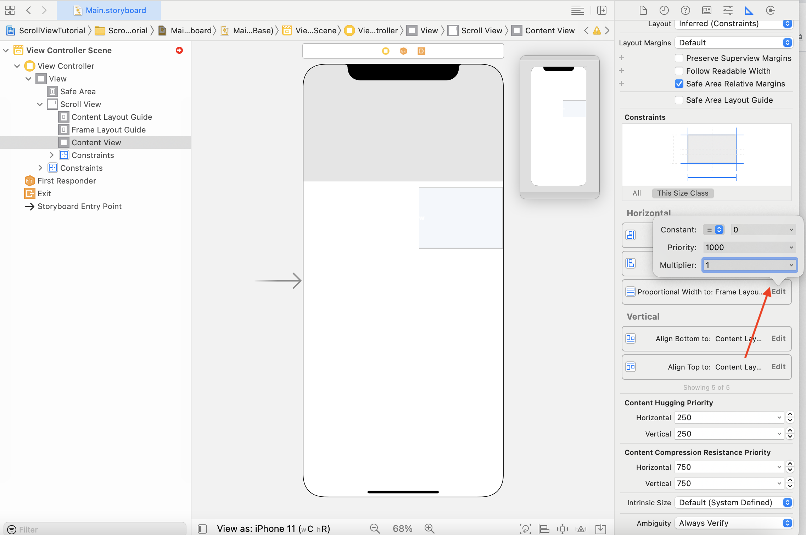

ScrollView 通过可以其中的滚动区域来正确工作

为了使 ScrollView 在Auto Layout下能正确工作， ScrollView 必须知道它的可滚动区域的宽高和它自己相对于父视图的 frame（x, y, with, heigh）。

从Xcode11开始，苹果引入了 `Content Layout Guide`  和 `Frame Layout Guide` ，它们使得 ScrollView 更加容易设计UI。 

为了使 ScrollView 正确工作，必须设置两组约束。

1. **设置 ScrollVeiw 相对与父视图的约束**
2. **设置 ScrollView 内可滚动区域的约束**，以便ScrollView知道能够向什么方向滚动。

### ScrollView 设置约束

#### 1. 添加 ScrollView 

放一个 ScrollView 到一个 ViewController 中并设置约束， 一般设置为距离 safe area 的边距(top, leading, trailing, bottom) 为0

#### 2. 添加 Content View 并设置约束

放一个 `UIVeiw` 到 `ScrollView` 内 (把该 UIView 的名称修改为 `Content View` )， 选中 `Content Veiw` 后按住 `Control` 按键，鼠标箭头移动到 `Content Layout Guide` 上， 在弹出的对话框中， 按住 `Shift` 按键，分别勾选

 `Leading Sapce to Cotent Layout Guide` 、

`Top Space to Content Layout Guide` 、

`Trailing Space to Content Layout Guide` 、

`Bottom Space to Content Layout Guide` 

当约束创建完毕之后，**把创建的约束的值设置为0**

#### 3. 设置 Content View 的宽

选中 `Content Veiw` 后按住 `Control` 按键，鼠标箭头移动到 `Frame Layout Guide` 上， 在弹出的对话框中勾选 `Equal With` 

把创建的约束 `Multiplier` 修改为 **1**

#### 4. 设置 Content View 的高

选中 `Content View` 添加约束， 高度设置为一个比较大的值，例如 1000。（可以在之后删除）

### 添加其他子元素

在 ScrollView 的 Content View 中添加所需要的元素（例如 UILabe、UIImageView、UIButton等等），并按照从上到下的顺序依次设置每个子元素的约束（约束相对与 Content View）

### 删除 Content View 的高

当所有子元素的约束都设置完毕之后 `Auto Layout` 会计算出 `Content View` 的高度， 这时我们可以删除之前设置的固定高度。

### 参考

[How to use Scroll view in Interface Builer](https://fluffy.es/scrollview-storyboard-xcode-11/#structure)

