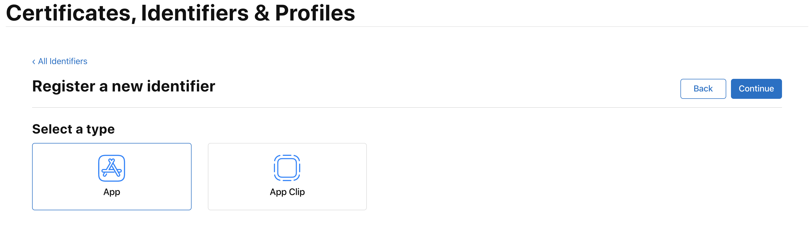
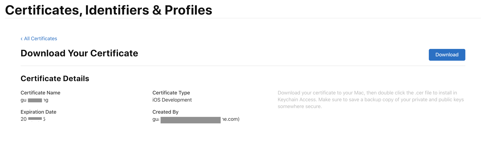
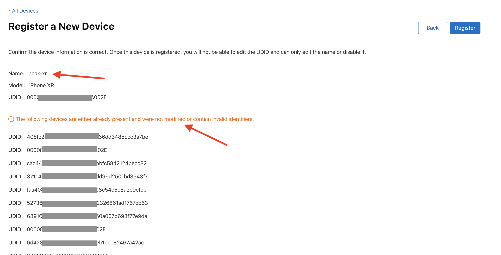
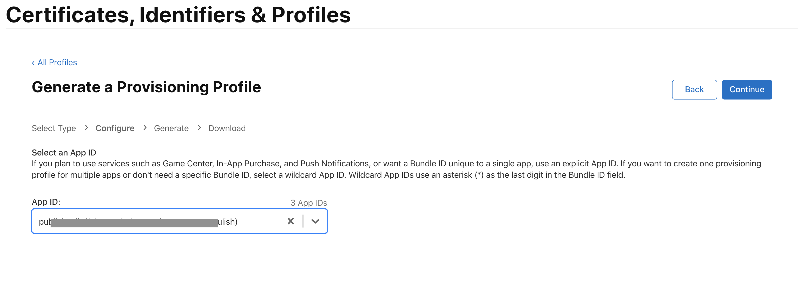

### iOS 证书创建流程

<p align="right">Update: 2020-10-15</p>


#### 1. 创建App ID

登录苹果账号， 选择  `Certificates, Identifiers & Profiles`  


选中 `Identifiers` ，点击 `Registers an App ID` 


选中  `App IDs` ，点击 `Continue` 


选中 `App`  ， 点击 `Continue` 




在 `Capabilities` 列表中选择所需功能， 点击 `Register`


#### 2. 创建 Certificates

##### 2.1 创建 `.certSigningRequest` 文件

打开 `钥匙串`,  点击 `钥匙串访问`  —>  `证书助理`  —>  `从证书颁发机构请求证书`


输入邮箱名称 和 用户名， 选择 `存储到磁盘` ,  点击 `继续`， 选择目录存储到本地。 

默认会生成一个 `CertificateSigningRequest.certSigningRequest` 文件。


##### 2.2 创建开发证书

选中 `Certificates`   点击 `+`


选中 `iOS App Development`  ，点击 `Continue` 


**注意**

- `Apple Development`
  - 开发阶段的 App 证书，用于给 iOS, MacOS, tvOS, watchOS app 签名。 用于Xcode11以及以上版本。
- `Apple Distribution`
  - 发布阶段的 App 证书，用于给 iOS, MacOS, tvOS, watchOS app 签名。 用于Xcode11以及以上版本。
- `iOS Development`
  - 开发阶段的 iOS App证书。
- `iOS Distribution(App Store and Ad Hoc)`
  - 发布阶段的 iOS App证书。
- `Apple Push Notification service SSL (Sandbox)`
  - 开发阶段的推送证书。
- `Apple Push Notification service SSL (Sandbox & Production)`
  - 发布阶段的推送证书。

**参考**

[Certificates](https://developer.apple.com/support/certificates/)

[What is app signing](https://help.apple.com/xcode/mac/current/#/dev3a05256b8)


选择已经创建好的 `CertificateSigningRequest.certSigningRequest` 文件， 点击 `Continue` 


点击 `Download` ，下载到本地后双击即可安装到钥匙串。



##### 2.3 创建发布证书

流程与创建开发证书类似， 证书类别需要选择 `iOS Distribution(App Store and Ad Hoc)`


#### 3. 添加测试设备

选中 `Devices` 点击 `+`


左侧表示注册单个设备id， 需要选择  `Platform` 后，输入 `Device Name`  和`Device UUID` ；

右侧表示注册多个设备id，选择 `.deviceids` 格式的文件上传即可；


新注册设备显示在上面， 已经注册的设备显示在下面。




#### 4. 创建Profile文件

##### 4.1 创建 Development  `.mobileprovision 文件`

选中`Profiles` ，点击 `+`


证书类型选中 `iOS App Development` ，点击 `Continue`


**注意**

- `iOS App Development`
  - 测试阶段的profile文件
- `Ad Hoc`
  - 发布阶段的profile文件，可以安装在测试设备上
- `App Store`
  - 发布阶段的profile文件，不可以安装在测试设备上

简单总结:  `Ad Hoc` = `iOS App Development` + `App Store`


选择合适的 App ID，点击 `Continue`



选择合适的证书，点击 `Continue`


选择需要添加的测试设备，点击`Continue`


输入文件名称，点击 `Generate` ，之后点击 `Download` ，下载 `xxx.mobileprovision` 文件到本地， 双击即可安装。


`xxx.mobileprovision` 文件本地安装位置:

```shell
~/Library/MobileDevice/Provisioning Profiles/
```


`xxx.mobileprovision` 文件内容查询命令:

```shell
security cms -D -i <path-to-mobileprovision-file>
```


##### 4.2 创建 Distribution `.mobileprovision文件`

同 创建 Development  `.mobileprovision 文件` 过程类似，证书类型需要选中 `App Store` 。

