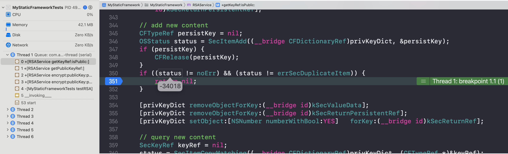
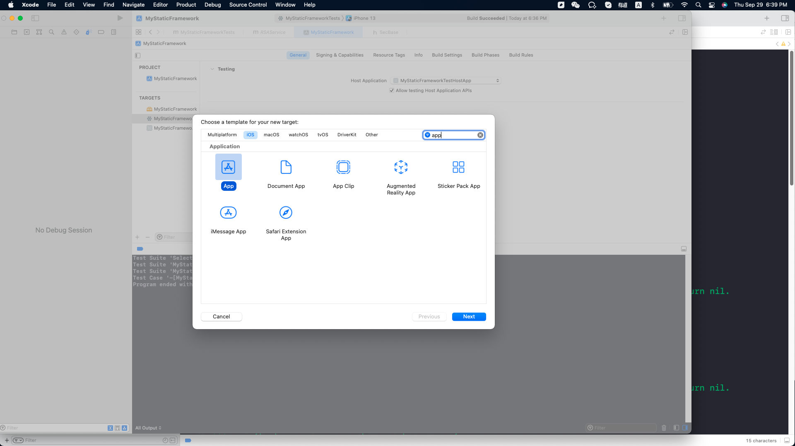
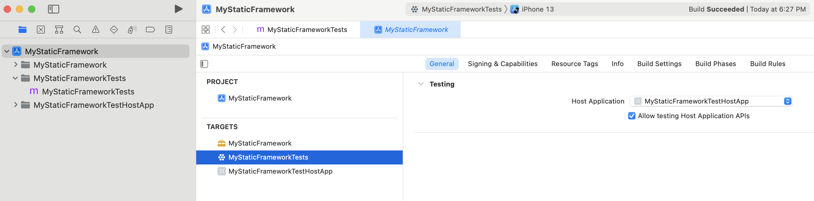

# How to test static framework in iOS?

  My **static framework** provide a function which will access key chain inside the method, when I write a unit test method, it return `errSecMissingEntitlement` error code.



The definition of `errSecMissingEntitlement` was in the `<Security/SecBase.h>` framework as following:

```objective-c
errSecMissingEntitlement                 = -34018,    /* A required entitlement isn't present. */
```


## How to solve this peoplem?

1. In your framework project add a new target (select `App` template) as the host app.




2. In you unit test target,  `General` -> `Testing` select the host app.

