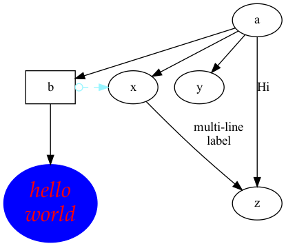
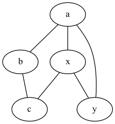
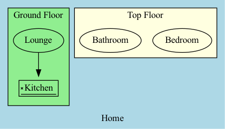

# Graphviz

Graphviz is a open source graph visualization software. Graph visualization is a way of representing structural information as diagrams.


## Install

Install executable packages 

> brew install graphviz


Install [source code](https://graphviz.org/download/source/)


## Basic Rules

Some basic rules about DOT Language:

- Literal characters are given in single quotes.

- Parenthese `(` and `)` indicate grouping when needed.

- Square brackets `[` and `]` enclose optional items.

- Vertical bars `|` separate alternatives.
- `//` or `/***/` as comments.
- Semicolons `;` and commas `,` aid readability but are not required.
- Use attributes to customize the layout of `node` , `edge`, `graph`, etc.


## Keywords

### graph

Generate undirected graphs and pecify an edge using the edge operator `--` .

### digraph

Generate directed graphs and specify an edge using the edge operator `-->` .

### node

A node is a point that contains some infomation about a graph.

### edge

A shape connecte multiple nodes.


## Usage

### digraph example

Create a file name it as `test1.dot` and paste the following code into it.

```visual basic
digraph test_node_id {
     a -> b -> c;
     a -> {x y};
     
     // set attribute about node b
     b [shape=box]
     
     // set attribute about node c
     c [label="hello\nworld" color=blue fontsize=24,
          fontname="Palatino-Italic",fontcolor=red,style=filled];
     
     /** set edge attribute between node a and z*/
     a -> z [label="Hi", weight=100];
     x -> z [label="multi-line\nlabel"];
     
     // set edge attribute betwween node b and x
     edge [style=dashed,color=red, arrowtail=odot,dir=both];
     // override the edge attribute between node b and x
     b -> x [color=cadetblue1];
     
     // set constraints between node b and x
     {rank=same; b x}
}
```

Run the following command to generate a png command:

> dot -Tpng test1.dot -o test1.png

The output as the following:




### Graph example

Create a file name it as `test2.dot` and paste the following code into it.

```
graph test123 {
     a -- b -- c;
     a -- {x y};
     x -- c [w=10.0];
     x -- y [w=5.0,len=3];
}
```

Run the following command to generate a png command:

> dot -Tpng test2.dot -o test2.png

The output as the following:



### Subgraph example

Create a file name it as `test3.dot` and paste the following code into it.

```visual basic
digraph {
  bgcolor="lightblue"
  label="Home"
  subgraph cluster_ground_floor {
    bgcolor="lightgreen"
    label="Ground Floor"
    Lounge -> Kitchen
    // Set the shape about the Kitchen node
    Kitchen [shape=signature]
  }
  subgraph cluster_top_floor {
    bgcolor="lightyellow"
    label="Top Floor"
    Bedroom
    Bathroom
  }
}
```

Run the following command to generate a png command:

> dot -Tpng test3.dot -o test3.png

The output as the following:

