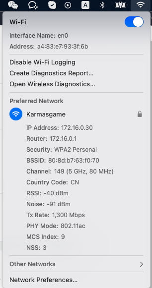

# Get WiFi info?


## A fast way to find you WIFI info?

Hold on the `Option`  key and then click on the WiFi menu icon from the Menu Bar in you Mac.




## How to get WiFi password from terminal?

Using the following command to get your WiFi info:

```shell
security find-generic-password -ga <wifi-name>
```


Once you execute the command, the system will show a promotion that warns you need to type the `User Name` and `Password` of your machine.

After you finish inputting and click the `Allow` button, you will get the detailed infomation about your WiFi.

For example:

```shell
$ security find-generic-password -ga Karmasgame
keychain: "/Library/Keychains/System.keychain"
version: 256
class: "genp"
attributes:
    0x00000007 <blob>="Karmasgame"
    0x00000008 <blob>=<NULL>
    "acct"<blob>="Karmasgame"
    "cdat"<timedate>=0x32303232303132343038343431305A00  "20220124084410Z\000"
    "crtr"<uint32>=<NULL>
    "cusi"<sint32>=<NULL>
    "desc"<blob>="AirPort network password"
    "gena"<blob>=<NULL>
    "icmt"<blob>=<NULL>
    "invi"<sint32>=<NULL>
    "mdat"<timedate>=0x32303232303132343038343431305A00  "20220124084410Z\000"
    "nega"<sint32>=<NULL>
    "prot"<blob>=<NULL>
    "scrp"<sint32>=<NULL>
    "svce"<blob>="AirPort"
    "type"<uint32>=<NULL>
password: "Pw@MyHome2022"
```


## How to format a WiFi scheme URL?

Generate a url which contains the WIFI information , so suers can follow links from QR codes, to join networks without having to manually enter the data.

- Common format: `WIFI:S:<SSID>;T:<WEP|WPA|blank>;P:<PASSWORD>;H:<true|false|blank>;`
- Sample `WIFI:S:<wifi-name>;T:WPA;P:<wifi-password>;;`


## Reference

[Wi-Fi](https://en.wikipedia.org/wiki/Wi-Fi#Securing_methods)

[wifi-password](https://github.com/rauchg/wifi-password)

[wifi-card](https://wificard.io)